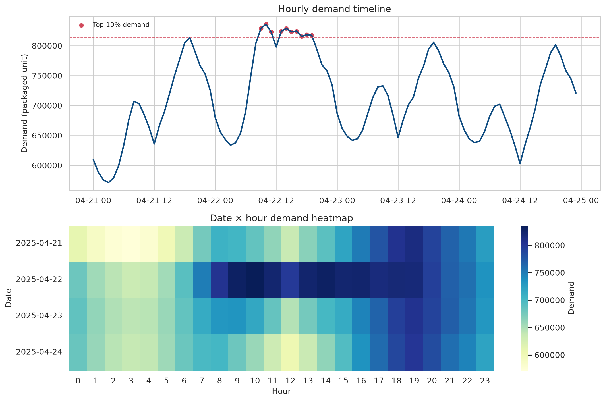
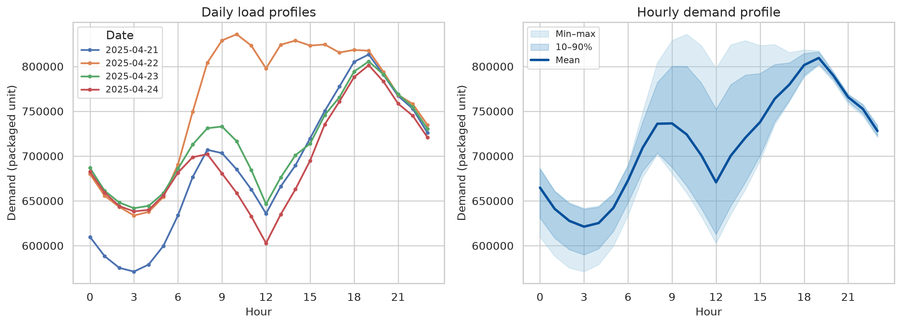
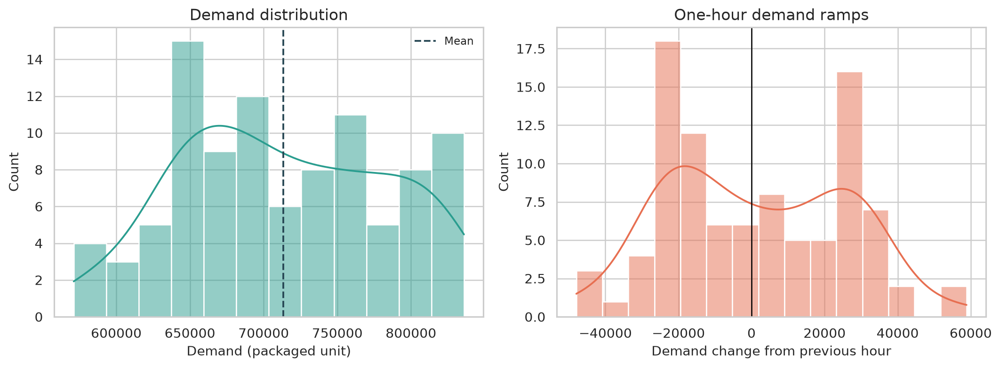
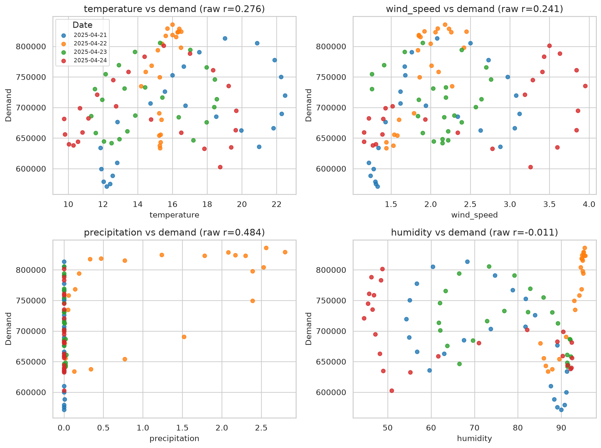
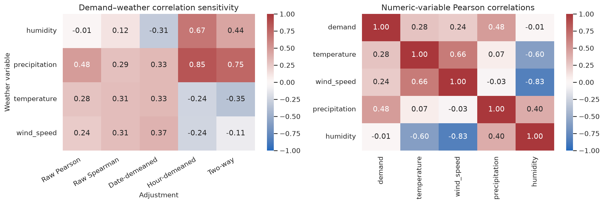
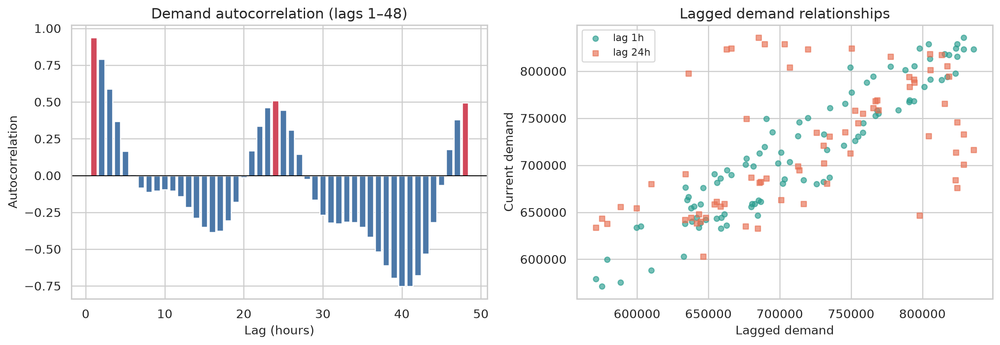
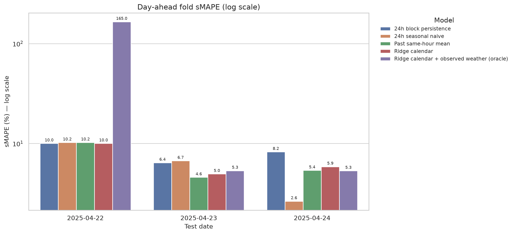
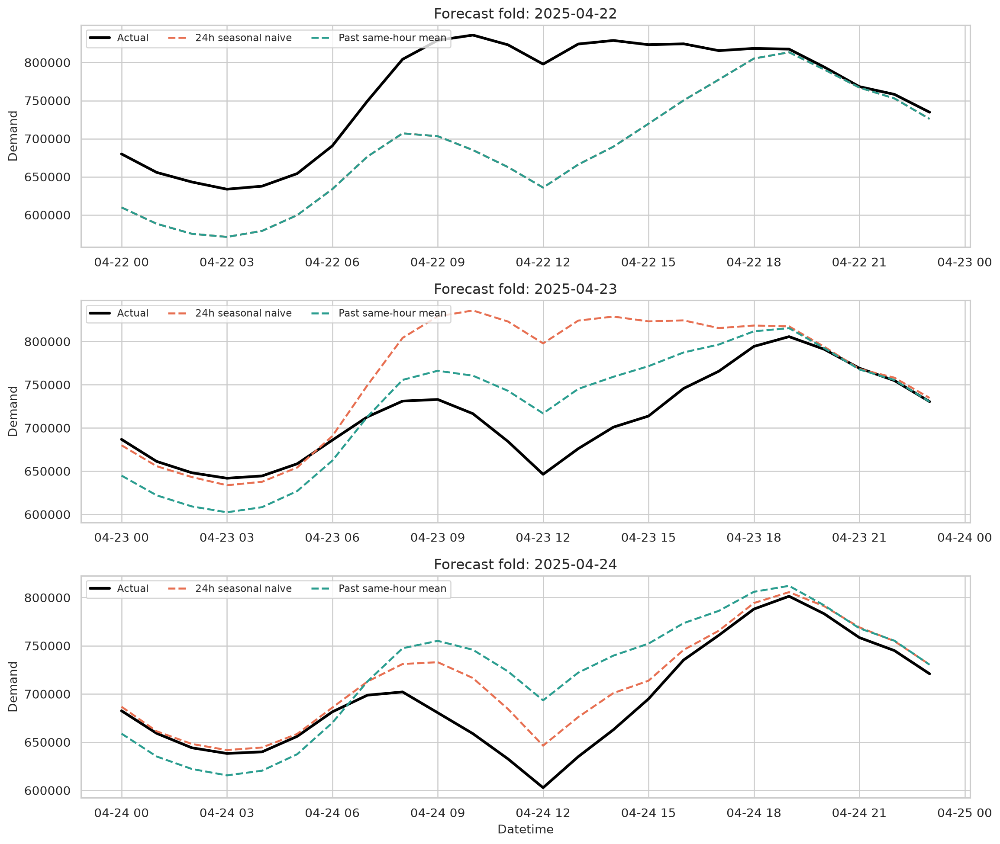
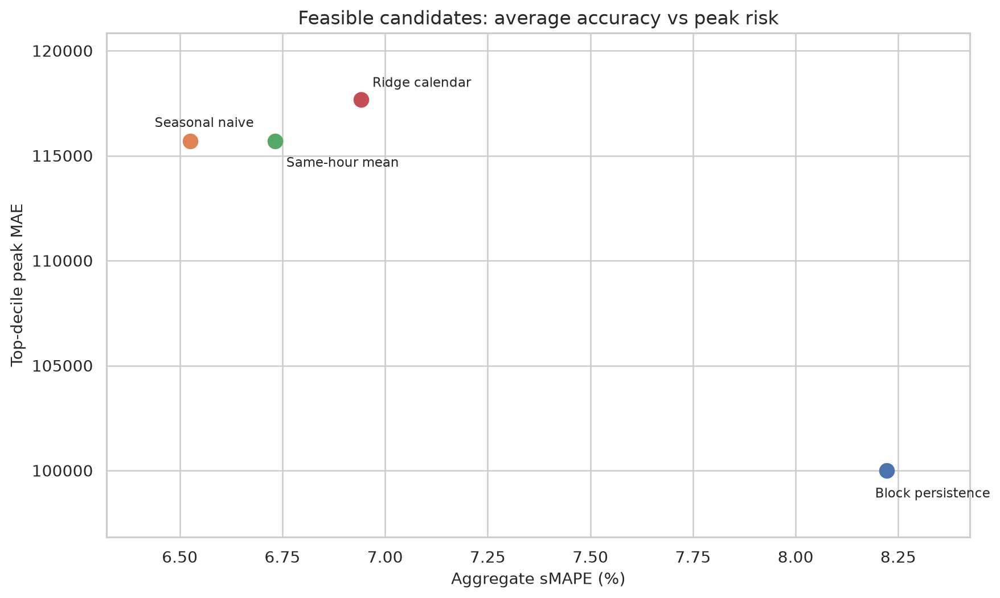
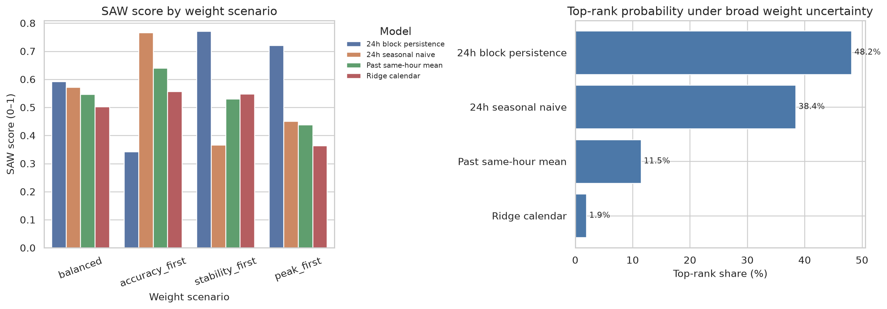

# Team 5 전력수요 예측 프로젝트

## 확장 데이터 분석 및 재현성 감사 보고서

- 분석 기준일: 2026-07-11
- 분석 표본: 2025-04-21 00:00 ~ 2025-04-24 23:00, 96시간
- 실행 노트북: [`team5_expanded_analysis.ipynb`](team5_expanded_analysis.ipynb)
- 생성 결과: [`analysis_outputs/tables/`](analysis_outputs/tables/), [`analysis_outputs/figures/`](analysis_outputs/figures/)
- 수요 단위: 원천 검증 전이므로 **packaged unit**으로 표기

> **최종 판단:** 현재 프로젝트는 문제 방향과 변수 구성은 타당하지만, 전체 학습 데이터·원시자료·중간파일·예보기상 이력이 없어 기존 XGBoost 성능을 독립 재현할 수 없다. 96시간 샘플에서 복잡한 모델을 승인할 근거도 없다. 우선순위는 모델 고도화가 아니라 데이터 복구, 단위·시간축 검증, 누수 없는 day-ahead 평가다.

---

## 0. 한눈에 보는 결론

| 상태 | 확인 결과 | 의사결정 의미 |
|---|---|---|
| ✅ 재현됨 | 최종 샘플은 96시간이며 결측·중복·시간누락이 없다. | 최종 CSV의 형식적 품질은 양호하다. |
| ✅ 재현됨 | `sample_data.csv`와 팀 폴더의 `data.csv`는 SHA-256이 완전히 같다. | 두 번째 파일은 추가 학습자료가 아니라 동일 복제본이다. |
| ✅ 재현됨 | 시간대 평균수요는 03시 621,251로 가장 낮고 19시 809,492로 가장 높다. | 하루 안의 시간패턴은 강한 기본 예측정보다. |
| ⚠️ 제한적 | 강수–수요 원 Pearson 상관은 0.484지만 총 강수의 99.49%가 하루에 몰렸다. | 상관을 강수의 인과효과로 해석하면 안 된다. |
| ⚠️ 제한적 | 24시간 계절 나이브의 3-fold sMAPE는 전체 6.53%, 날짜별 10.23%·6.70%·2.64%다. | 기존 마지막 날 2.64%는 가능한 세 날짜 중 가장 좋은 결과였다. |
| ⚠️ 제한적 | 전체 sMAPE는 계절 나이브 6.53%, 동일시간 평균 6.73%, Ridge 달력 6.94%, 24h block 지속성 8.22%다. | 복잡한 모델의 우위가 확인되지 않았다. |
| ❌ 결격 | 실제 미래 관측기상 Ridge는 첫 fold에서 음수 수요 19건을 만들고 전체 sMAPE가 58.56%였다. | 관측기상은 운영 입력이 아니며, 짧은 학습기간의 외삽은 위험하다. |
| ❌ 재현 불가 | `merged data.csv`, `best2.json`, KPX·AWS·KOSIS 원시·중간파일이 없다. | 기존 XGBoost·SHAP·전처리 결과를 독립 검증할 수 없다. |

### 권고 의사결정

1. 기존 XGBoost 결과를 **탐색적 프로토타입**으로 분류하고 운영모델로 승인하지 않는다.
2. 전체 데이터가 복구되기 전에는 lag-24 계절 나이브와 동일시간 평균을 비교 기준선으로만 유지한다.
3. 최소 2년 이상의 시간당 수요·달력·예보기상 vintage를 확보한 뒤 rolling-origin 개발과 완전 격리 final test를 수행한다.
4. 최종 선택은 평균 sMAPE뿐 아니라 fold 안정성, 피크 MAE, 과소예측, 예측구간, 재현성, 비용을 모두 통과할 때만 한다.

---

## 1. 분석 질문과 평가 규칙

### 핵심 질문

과거 수요·달력·예보 시점에 이용 가능한 기상정보를 사용하여 다음날 00~23시의 전국 발전단 전력수요를 한 번에 예측할 때, 복잡한 모델이 단순 계절 기준선보다 안정적이고 운영상 안전한가?

### 분석단위와 지표

| 구분 | 정의 |
|---|---|
| 표적 | 전국 전력수요로 추정되는 `demand`; 공식 단위·배율은 미확정 |
| 예측지평 | 전일 시점에서 다음날 24개 시간을 일괄 예측하는 day-ahead |
| Primary KPI | sMAPE |
| 보조 정확도 | MAE, RMSE, WAPE, R² |
| 운영 guardrail | 편향, 과소예측률, 상위 10% 피크 MAE, 음수예측 |
| 안정성 | 날짜별 fold sMAPE 범위 |
| 재현성 | 빈 커널 Run All, 데이터 지문, 모든 표·그림 자동 생성 |

`rolling one-step`은 매시간 실제 직전수요를 새로 받는 다른 문제다. 따라서 본문의 day-ahead 모델 순위표와 섞지 않았다.

---

## 2. 데이터 인벤토리와 경계

### 2.1 실제 분석 파일

| 파일 | 크기 | SHA-256 | 판정 |
|---|---:|---|---|
| `sample_data.csv` | 4,695 bytes | `fb214f92f1ea57ff0f5ce5f64f6be61ee139f2d89f1041fff1a4f3b47f3b82a4` | 분석 원본 |
| `강의 2강/team5/데이터 일체/data.csv` | 4,695 bytes | 동일 | 원본과 바이트 단위 동일한 복제본 |

### 2.2 추론 스키마

| 변수 | 역할 | 단위 상태 | 검증 상태 |
|---|---|---|---|
| `datetime` | 시간키 | 시간대 미확정, KST 추정 | 정시·중복·간격 확인 |
| `demand` | 예측표적 | 공식 단위·배율 미확정 | 비음수, 원천 lineage 필요 |
| `temperature` | 기상 | °C 추정 | 물리범위·원천 확인 필요 |
| `wind_speed` | 기상 | m/s 추정 | 비음수 |
| `precipitation` | 기상 | mm 추정 | 비음수, 0이 많은 분포 |
| `humidity` | 기상 | % 추정 | 0~100 |

### 2.3 재현 불가능한 범위

다음 파일 또는 파일군이 원 코드에서 참조되지만 패키지에 없다.

- `merged data.csv`, `best2.json`
- `../data/kpx/kpx_data.csv`
- `../data/AWS/인구 가중치.csv`, `../data/AWS/태양광 가중치.csv`
- KPX·AWS·KOSIS 원시파일과 데이터 생성 로그

따라서 원천자료 수집 → 시간변환 → 관측소 매핑 → 공간가중 → 병합 → feature 생성 → XGBoost 학습의 전체 lineage는 검증되지 않았다.

---

## 3. 데이터 품질과 표본 커버리지

### 3.1 최종 샘플 품질

| 점검 | 결과 |
|---|---:|
| 관측치 | 96 |
| 예상 시간 수 | 96 |
| 결측 셀 | 0 |
| 무한값 | 0 |
| 중복 행 | 0 |
| 중복 시각 | 0 |
| 누락 시각 | 0 |
| 1시간 간격 이탈 | 0 |
| 음수 수요·풍속·강수 | 0 |
| 습도 0~100 범위 이탈 | 0 |

최종 파일 자체의 형식적 품질은 양호하다. 다만 원 `가중합.py`가 upstream 기상 결측을 0으로 치환하므로 **최종 결측 0건은 원시자료 완전성의 증거가 아니다**. 원시 결측률·대체 전후 값·대체 근거가 별도로 필요하다.

### 3.2 대표성 한계

- 4일, 1개월, 월~목만 포함한다.
- 주말 0시간, 휴일 0일, 계절변화가 없다.
- 날짜와 요일이 1:1로 겹쳐 날짜효과와 요일효과를 분리할 수 없다.
- 강수시간은 32/96, 1mm 이상은 11/96이다.
- 총 강수 27.20 중 27.06, 즉 99.49%가 4월 22일 하루에 집중된다.



**그림 1.** 위는 96시간 수요와 상위 10% 수요시간, 아래는 날짜×시간 수요다. 4월 22일의 높은 수준과 저녁 피크가 동시에 보인다.

---

## 4. 확장 탐색적 데이터 분석

### 4.1 수준과 분포

| 지표 | 수요 |
|---|---:|
| 평균 | 713,455 |
| 표준편차 | 70,129 |
| 최소 | 571,137 |
| 중앙값 | 705,141 |
| 최대 | 835,946 |
| 변동계수 | 9.83% |

일평균은 4월 21일 686,926에서 4월 22일 760,111로 73,185, 약 10.65% 증가했다. 이 수준차이는 강수·요일·기온 중 어느 하나의 독립효과로 분리할 수 없다.

### 4.2 시간대 패턴

- 평균수요 최저: 03시 621,251
- 평균수요 최고: 19시 809,492
- 차이: 188,241, 최저 대비 30.30%
- 상위 10% 기준: 814,461
- 상위 10% 10시간은 모두 4월 22일 09~19시 구간에 있다. 단 12시는 제외된다.



**그림 2.** 날짜별 수준은 다르지만 새벽 저점과 저녁 고점이 반복된다. 음영 폭이 큰 오전·정오 구간은 날짜 간 변동이 크다.

### 4.3 시간당 램프

| 지표 | 값 |
|---|---:|
| 절대 램프 평균 | 21,220 |
| 절대 램프 중앙값 | 22,594 |
| 절대 램프 90백분위 | 33,368 |
| 최대 상승 | +58,849, 4월 22일 07시 |
| 최대 하락 | -47,952, 4월 23일 00시 |



**그림 3.** 평균오차만으로는 급상승·급하락을 놓칠 수 있다. 향후 모델은 램프가 큰 시간의 오차를 subgroup으로 보고해야 한다.

---

## 5. 기상과 수요의 관계

### 5.1 원상관

| 변수 | Pearson r | Spearman ρ |
|---|---:|---:|
| 기온 | 0.276 | 0.312 |
| 풍속 | 0.241 | 0.306 |
| 강수 | 0.484 | 0.292 |
| 습도 | -0.011 | 0.121 |

시간자기상관과 날짜 군집 때문에 일반적인 독립표본 p-value는 지나치게 작아질 수 있어 보고서의 결론 근거에서 제외했다.



**그림 4.** 같은 색의 점이 날짜별로 묶이는 구조가 보인다. 특히 강수량이 큰 점은 대부분 4월 22일에 속한다.

### 5.2 교란 통제 방식에 따른 민감도

| 변수 | 원 Pearson | 날짜평균 제거 | 시간대평균 제거 | 날짜·시간대 동시 제거 |
|---|---:|---:|---:|---:|
| 기온 | 0.276 | 0.333 | -0.244 | -0.354 |
| 풍속 | 0.241 | 0.366 | -0.242 | -0.108 |
| 강수 | 0.484 | 0.329 | 0.850 | 0.751 |
| 습도 | -0.011 | -0.309 | 0.673 | 0.435 |

방향이 바뀌거나 크기가 크게 달라진다. 이는 어떤 보정을 선택하느냐에 따라 관계가 흔들린다는 뜻이며, 4일 표본에서 독립적인 기상효과를 주장할 수 없음을 보여준다. 시간대평균 제거 후 강수 상관이 더 커지는 것도 강수효과의 확증이 아니라, 동일 시간대에서 4월 22일이 동시에 비가 많고 수요가 높았기 때문이다.

기상변수끼리도 풍속–습도 상관이 -0.828이고 습도 VIF가 약 6.16이다. 단변량 상관을 각 변수의 독립효과처럼 해석하면 안 된다.



**그림 5.** 보정 방식별 상관 변화와 기상변수 간 다중공선성을 함께 제시했다.

---

## 6. 시간의존성

| lag | 자기상관 | 유효 쌍 수 |
|---:|---:|---:|
| 1시간 | 0.939 | 95 |
| 2시간 | 0.790 | 94 |
| 3시간 | 0.589 | 93 |
| 6시간 | 0.009 | 90 |
| 12시간 | -0.141 | 84 |
| 24시간 | 0.509 | 72 |
| 48시간 | 0.496 | 48 |
| 72시간 | 0.874 | 24 |

lag-72가 높아 보여도 쌍이 24개뿐이며 사실상 4월 21일과 24일 두 곡선의 유사성을 반영한다. lag별 표본 수를 함께 보지 않으면 과대해석하기 쉽다.



**그림 6.** lag-1은 매우 강하지만, day-ahead 시점에 다음날 내부의 실제 lag-1은 알 수 없다. 운영 가능한 feature와 사후 진단 feature를 구분해야 한다.

---

## 7. 24시간 day-ahead 백테스트

### 7.1 평가 설계

첫날 이후 가능한 세 날짜를 순차 test로 사용했다.

| fold | 학습시간 | test | 예측지평 |
|---:|---:|---|---:|
| 1 | 24시간 | 2025-04-22 | 24시간 일괄 |
| 2 | 48시간 | 2025-04-23 | 24시간 일괄 |
| 3 | 72시간 | 2025-04-24 | 24시간 일괄 |

모든 후보가 동일 지평에서 평가되며, Ridge의 `alpha=10`은 이 짧은 표본에서 튜닝하지 않은 진단 설정이다.

### 7.2 날짜별 계절 나이브 결과

| test 날짜 | sMAPE | 편향(예측-실제) | 과소예측률 |
|---|---:|---:|---:|
| 2025-04-22 | 10.23% | -73,185 | 100.0% |
| 2025-04-23 | 6.70% | +47,646 | 29.2% |
| 2025-04-24 | 2.64% | +18,147 | 0.0% |

마지막 날은 sMAPE가 가장 낮지만 24시간 모두 과대예측했다. 평균 정확도가 좋아도 오차 방향은 편향될 수 있다.



**그림 7.** y축은 log scale이다. 기존 단일 홀드아웃은 날짜별 변동을 숨겼다. 관측기상 Ridge의 첫 fold 165.0%는 외삽 실패다.

### 7.3 3-fold 전체 결과

| 모델 | MAE | sMAPE | fold 범위 | 편향 | 과소예측률 | 피크 MAE |
|---|---:|---:|---:|---:|---:|---:|
| 24h 계절 나이브 | 47,364 | **6.53%** | 7.59%p | -2,464 | 43.1% | 115,694 |
| 과거 동일시간 평균 | 47,537 | 6.73% | 5.64%p | -12,205 | 55.6% | 115,694 |
| Ridge 달력 | 50,568 | 6.94% | 5.05%p | -12,205 | 56.9% | 117,671 |
| 24h block 지속성 | 59,447 | 8.22% | **3.59%p** | +8,099 | 43.1% | **100,004** |
| Ridge 달력+관측기상 oracle | 2,050,018 | 58.56% | 159.68%p | -2,032,549 | 72.2% | 10,370,216 |

계절 나이브는 평균 sMAPE가 가장 낮지만 fold 변동이 가장 크다. Block 지속성은 평균 정확도가 나쁘지만 이 표본에서는 fold 범위와 피크 MAE가 낮다. 따라서 무엇을 우선하느냐에 따라 판단이 바뀐다.



**그림 8.** 4월 22일의 수준상승, 4월 23일 정오 저점, 4월 24일의 높은 전일 유사성이 기준선 오차를 좌우한다.



**그림 9.** 왼쪽 아래가 바람직하다. 하나의 후보가 정확도와 피크위험을 동시에 지배하지 않는다. 결격 oracle은 축 왜곡을 막기 위해 제외했다.

---

## 8. 기상 외삽 스트레스

첫 fold의 학습일에는 강수가 0~0.01 범위였지만 test일에는 24시간 중 23시간이 이 범위를 벗어났다. 습도도 17/24시간이 학습범위 밖이었다.

| 첫 fold 관측기상 Ridge | sMAPE | 음수예측 | 예측 최소 |
|---|---:|---:|---:|
| 원 관측기상 | 165.00% | 19 | -14,238,461 |
| train 범위 clipping | 19.15% | 0 | 578,975 |

Clipping은 물리적으로 불가능한 음수예측을 막았지만 sMAPE 19.15%로 여전히 나쁘다. 해결책은 test 값을 억지로 자르는 것이 아니라 충분한 기상범위가 포함된 장기 학습자료와 실제 발행시각의 예보기상을 쓰는 것이다.

---

## 9. 임시 SAW와 가중치 민감도

### 9.1 하드 게이트

실제 미래 관측기상을 필요로 하고 음수예측을 만든 oracle Ridge는 의사결정 후보에서 제외했다.

### 9.2 기준과 기본 가중치

| 기준 | 가중치 | 방향 |
|---|---:|---|
| 전체 sMAPE | 35% | 낮을수록 좋음 |
| fold sMAPE 범위 | 25% | 낮을수록 좋음 |
| 피크 MAE | 20% | 낮을수록 좋음 |
| 절대 편향 | 10% | 낮을수록 좋음 |
| 단순성 | 10% | 높을수록 좋음 |

수치기준은 후보 내 min-max 효용점수로 바꿨다. 단순성은 명시적으로 block·계절 나이브 1.00, 동일시간 평균 0.95, Ridge 0.80으로 뒀다.

### 9.3 시나리오 결과

| 시나리오 | 1위 | 점수 | 2위 | 점수 |
|---|---|---:|---|---:|
| 균형 | 24h block 지속성 | 0.592 | 계절 나이브 | 0.572 |
| 정확도 우선 | 계절 나이브 | 0.767 | 동일시간 평균 | 0.640 |
| 안정성 우선 | 24h block 지속성 | 0.771 | Ridge 달력 | 0.548 |
| 피크 우선 | 24h block 지속성 | 0.721 | 계절 나이브 | 0.450 |

기본 가중치 주변을 넓게 변동시킨 10,000회 Monte Carlo에서 1위 비중은 block 지속성 48.19%, 계절 나이브 38.43%, 동일시간 평균 11.45%, Ridge 달력 1.93%였다.



**그림 10.** 가중치에 따라 1위가 바뀐다. 이 SAW는 모델 승인표가 아니라 현재 판단이 강건하지 않음을 보여주는 진단이다.

---

## 10. 원본 코드와 재현성 감사

| 영역 | 핵심 결함 | 위험 | 조치 |
|---|---|---|---|
| 데이터 패키징 | 전체 원시·중간·merged 파일 누락 | Critical | 파일·자동수집·체크섬 제공 |
| `KPX 단위시간 변경.py` | 문자열로 누적한 값을 결과행에 저장하지 않음 | Critical | 수치형 resample과 총량보존 테스트 |
| `가중합.py` | 기상 결측 0 치환, 미매칭 관측소 조용히 제외 | High | 원시 결측률·대체로그·매칭률 보고 |
| `가중합.py` | 복수 관측소 지역의 전체 가중치 반복 위험 | High | 행정코드 조인, 지역 내 가중치 재배분 |
| `train.ipynb` | `merged data.csv`, `best2.json` 누락 | Critical | 완전한 데이터와 생성순서 제공 |
| `train.ipynb` | 셀 실행순서 혼재, GridSearch 중단 | Critical | 빈 커널 Run All과 고정 seed |
| `train.ipynb` | validation을 튜닝·선택·평가에 재사용 | High | 개발 CV와 최종 test 분리 |
| `train.ipynb` | day-ahead에서 당일 실제 lag-1/rolling과 미래 관측기상 사용 위험 | Critical | 발행시각 기준 feature contract |
| 표적 | 수요 단위·배율·발전단/판매단 의미 미확정 | High | 원천행부터 최종행까지 lineage test |

원 `train.ipynb`는 11개 셀이 모두 code이고 Markdown 셀이 없다. 실행번호도 순서가 뒤섞여 있고 중단된 탐색 출력에 의존한다. 새 노트북은 33개 셀 중 18개 Markdown, 15개 code로 구성했으며 모든 code cell이 1~15 순서로 실행되었다.

---

## 11. 불확실성·비용·편향

### 11.1 현재 하지 않은 검정

4일 표본에는 독립적인 날짜 block이 충분하지 않다. 따라서 다음을 최종 결론용으로 수행하지 않았다.

- 일·주 block bootstrap 신뢰구간
- Diebold–Mariano 검정
- 계절·휴일·폭염·한파 subgroup 추론
- 예측구간 coverage·pinball loss

데이터가 부족한데 검정 이름만 추가하는 것은 분석 강화가 아니다.

### 11.2 비용편익

`demand` 단위와 오차 1단위당 운영비용, 모델 구축·운영비가 없으므로 금액을 만들지 않았다.

```text
연간 총편익 = (기준선 MAE - 후보 MAE) × 연간 예측시간 × 오차단위당 비용
연간 순편익 = 연간 총편익 - (개발비 상각 + 인프라 + 데이터 + 모니터링 + 재학습)
```

3일 backtest 차이를 1년으로 단순 연환산하지 않는다.

### 11.3 편향 통제

| 편향 | 프로젝트 위험 | 통제 |
|---|---|---|
| 선택편향 | 가장 좋은 마지막 날만 보고 | 가능한 3개 fold 전부 공개 |
| 복잡성 편향 | XGBoost가 당연히 기준선보다 낫다고 가정 | 단순 기준선 우선 |
| 후견지명 편향 | 실제 미래 관측기상을 운영 입력처럼 사용 | 예보기상 vintage만 허용 |
| 확증편향 | 강수 상관을 원하는 설명으로 해석 | 날짜·시간대 보정 민감도 공개 |
| 단위 무시 | 숫자가 그럴듯하면 변환을 신뢰 | 원천–중간–최종 lineage test |
| 생존자 편향 | 중단된 GridSearch의 좋은 후보만 기억 | 전체 탐색로그·중단원인 기록 |

---

## 12. 전체 데이터 복구 후 분석 설계

### 12.1 데이터

1. 최소 2년 이상의 시간당 수요를 확보한다.
2. 타임스탬프 시간대, 수요 정의·단위·배율, 잠정치 수정여부를 고정한다.
3. 예보 발행시각별 기상 vintage와 관측기상을 분리한다.
4. KPX·AWS·KOSIS 원본, 변환본, 최종본에 SHA-256과 스키마 버전을 기록한다.
5. 관측소–행정구역 조인은 이름이 아니라 ID·행정코드로 수행하고 매칭률을 보고한다.

### 12.2 누수 없는 feature

- lag-24, lag-168
- 발행시각 이전에서 닫힌 rolling mean·std
- hour, weekday, holiday, bridge day
- 해당 발행시각에 실제 이용 가능한 예보기상
- 부하가중 기상과 태양광용량가중 기상을 분리한 feature

### 12.3 모델과 검증

| 단계 | 설계 |
|---|---|
| 기준선 | lag-24, lag-168, 혼합 계절 나이브, 동일요일·시간 평균 |
| 개발 | expanding-window rolling-origin, fold마다 다음날 24시간 일괄예측 |
| 튜닝 | 개발기간 내부에서만 수행 |
| 최종 test | 마지막 6~12개월 또는 1년 완전 격리, 한 번만 평가 |
| ablation | lag → 달력 → 예보기상 → 공간가중 기상 순서 |
| 지표 | sMAPE, WAPE, MAE, RMSE, MASE, 편향, 피크 MAE, 과소예측률 |
| 확률예측 | P10/P50/P90, coverage, width, pinball loss |
| 불확실성 | 일·주 block bootstrap, 충분한 test 길이에서 DM 검정 |
| subgroup | 시간대, 계절, 평일·주말·휴일, 강수, 기온극단, 상위 10% 수요 |

### 12.4 채택 게이트

- G1: 원천 단위·시간·결측·매칭률·가중치 검증 통과
- G2: 빈 환경에서 단일 Run All 또는 단일 명령 실행 성공
- G3: 최종 test에서 lag-24/168 대비 사전 정의한 정확도 개선
- G4: 개선의 block bootstrap 신뢰구간 또는 DM 검정이 지지
- G5: 피크 과소예측과 예측구간 coverage 기준 충족
- G6: 실제 운영비용 자료를 사용한 순편익 양수

---

## 13. 재현 방법

### 13.1 실행

```bash
python -m pip install -r requirements.txt
jupyter lab team5_expanded_analysis.ipynb
```

노트북을 열고 **Kernel Restart → Run All**을 실행한다. 실행이 끝나면 다음이 다시 생성된다.

- `analysis_outputs/tables/`: 25개 CSV
- `analysis_outputs/figures/`: 10개 PNG

### 13.2 핵심 검증값

- 입력 SHA-256: `fb214f92f1ea57ff0f5ce5f64f6be61ee139f2d89f1041fff1a4f3b47f3b82a4`
- 코드 셀 실행번호: 1~15 연속
- 오류 출력: 0건
- 24h seasonal naive 전체 sMAPE: 6.5255%
- 24h seasonal naive fold sMAPE: 10.2297%, 6.7035%, 2.6433%
- 균형 SAW 1위: 24h block 지속성 0.5922
- 정확도 우선 SAW 1위: 24h 계절 나이브 0.7668

기존 `reproduce_analysis.py`, DOCX, PDF는 비교용 초안으로 보존했으며 새 분석의 기준 산출물은 본 Markdown과 실행 완료 IPYNB다.

---

## 부록: 주요 결과 파일

- [데이터 품질표](analysis_outputs/tables/data_quality_checks.csv)
- [데이터 사전](analysis_outputs/tables/data_dictionary.csv)
- [표본 커버리지](analysis_outputs/tables/coverage_summary.csv)
- [기술통계](analysis_outputs/tables/descriptive_statistics.csv)
- [일별 요약](analysis_outputs/tables/daily_summary.csv)
- [시간대 프로파일](analysis_outputs/tables/hourly_profile.csv)
- [기상상관 민감도](analysis_outputs/tables/weather_correlation_sensitivity.csv)
- [자기상관](analysis_outputs/tables/demand_autocorrelation.csv)
- [fold별 백테스트](analysis_outputs/tables/backtest_fold_metrics.csv)
- [전체 백테스트](analysis_outputs/tables/backtest_aggregate_metrics.csv)
- [기상 외삽 스트레스](analysis_outputs/tables/weather_extrapolation_stress.csv)
- [SAW 매트릭스](analysis_outputs/tables/model_decision_matrix.csv)
- [가중치 민감도](analysis_outputs/tables/model_weight_sensitivity.csv)
- [소스코드 감사](analysis_outputs/tables/source_code_audit.csv)
